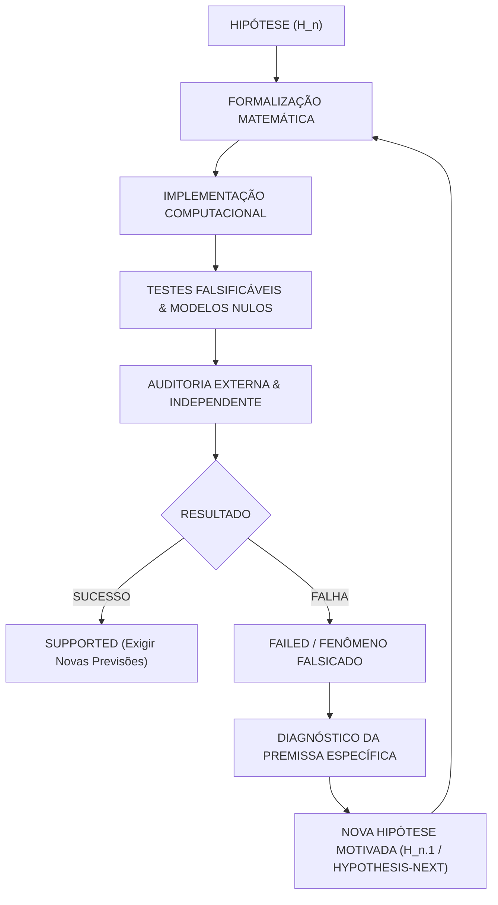

# PROTOCOLO DE PESQUISA ITERATIVA E FENOMENOLOGIA CIENTÍFICA
**Teoria Geométrico-Espectral da Emergência (TGE)**  
**Data de Formalização:** 2026-08-14  
**Fundamento Metodológico:** Partes XL a XLIV do Protocolo Mestre

---

## 1. Princípio Fundamental do Loop Iterativo

A falsificação de uma hipótese **NÃO** encerra a pesquisa nem invalida a busca por estruturas fundamentais. 
Ela encerra unicamente uma formulação matemática específica, delimitando o espaço de possibilidades físicas e matemáticas.

---

## 2. Regras de Transição de Hipóteses

Quando uma hipótese for falsificada:
1. **Preservação Histórica Total:** A hipótese anterior é mantida intacta com status `FAILED` no cadastro (`hypotheses.yaml` e `hypotheses.json`). Nunca modificar retroativamente o passado experimental.
2. **Isolamento da Premissa:** Identificar formalmente a premissa matemática que falhou:
   - Erro matemático formal?
   - Erro de discretização ou implementação numérica?
   - Hipótese insuficiente (modelo simples demais)?
   - Incompatibilidade intrínseca com os dados?
3. **Motivação Matemática Independente:** Uma formulação sucessora (`H_NEXT`) só pode ser criada se possuir justificativa axiomática ou algébrica independente (ex: representação de Clifford $\mathcal{C}\ell_{p,q}$, triplas espectrais de Connes com $KO$-dimensão mod 8, produtos tensoriais de geometrias discretas), e **NUNCA** por ajuste cosmético para forçar $d=4$ ou $(1,3)$.
4. **Critérios Pré-Definidos:** Critérios de sucesso e falha devem ser registrados **antes** da execução dos testes.

---

## 3. Diagnóstico das Premissas Falhas (TGE-CORE-03)

### Diagnóstico de Falha em $H_1$ ($d_{\text{spec}} \approx 4$):
- **Premissa Falha:** Um operador de Dirac gaussiano aleatório $D$ (GUE puro) gera espontaneamente um espaço de difusão quadridimensional ($d=4$).
- **Causa Matemática:** A densidade de autovalores de uma matriz aleatória hermitiana pura obedece à Lei do Semicírculo de Wigner $\rho(\lambda) \sim \sqrt{4-\lambda^2}$, cuja difusão no Heat Kernel $P(t) = \text{Tr}(e^{-t D^2})$ decai universalmente como $P(t) \propto t^{-1/2} \implies d_{\text{spec}} = 1.0$.
- **Caminho Matemático Sucessor ($H_{1.1}$):** Geometrias de produto tensorial não-comutativo $D_{\text{total}} = D_1 \otimes \mathbb{I} + \gamma_1 \otimes D_2$ ou operadores de Dirac em grafos/reticulados com $k$ dimensões topológicas.

### Diagnóstico de Falha em $H_2$ (Emergência Causal Lorentziana $(1,3)$):
- **Premissa Falha:** A imposição de uma única simetria de Krein $\eta$ sobre uma matriz hermitiana aleatória induz naturalmente a separação macroscópica em 1 dimensão temporal e 3 espaciais.
- **Causa Matemática:** A forma bilinear $G_{\text{eff}} = (\eta D)^\dagger (\eta D) + i[\eta, D]$ distribui seus autovalores de acordo com a dimensão dos subespaços $V_+$ e $V_-$ de $\eta$, gerando múltiplos autovalores negativos (ex: $(121, 7, 0)$) sem qualquer seleção natural de $1$ única direção temporal.
- **Caminho Matemático Sucessor ($H_{2.1}$):** Triplas espectrais reais graduadas $(\mathcal{A}, \mathcal{H}, D, J, \gamma)$ com álgebra de Clifford $\mathcal{C}\ell_{1,3}(\mathbb{R})$ e relações de $KO$-dimensão mod 8 de Barrett-Connes, onde a estrutura real $J$ e a quiralidade $\gamma$ impõem a métrica Lorentziana algebricamente.

---

## 4. Requisitos para Declaração de Unificação Físico-Matemática

Nenhuma alegação de *"Teoria Unificada / Teoria de Tudo"* é permitida sem a demonstração computacional e formal de todos os 6 pilares:
1. **Limite Gravitacional:** Recuperação da ação de Einstein-Hilbert no regime assintótico $\text{Tr}(f(D/\Lambda))$;
2. **Limite Quântico:** Recuperação dos campos fermiônicos e bosônicos de calibre ($SU(3) \times SU(2) \times U(1)$);
3. **Dinâmica Consistente:** Equações de movimento não-triviais estáveis;
4. **Causalidade Estável:** Assinatura pseudo-Riemanniana invariante sob difeomorfismos e transformações de calibre;
5. **Recuperação de Observáveis:** Massas, ângulos de mistura e constantes fundamentais sem fine-tuning $> 1:10^6$;
6. **Previsão Falsificável Fora da Amostra:** Previsão de ao menos um observável testável não utilizado no ajuste.
